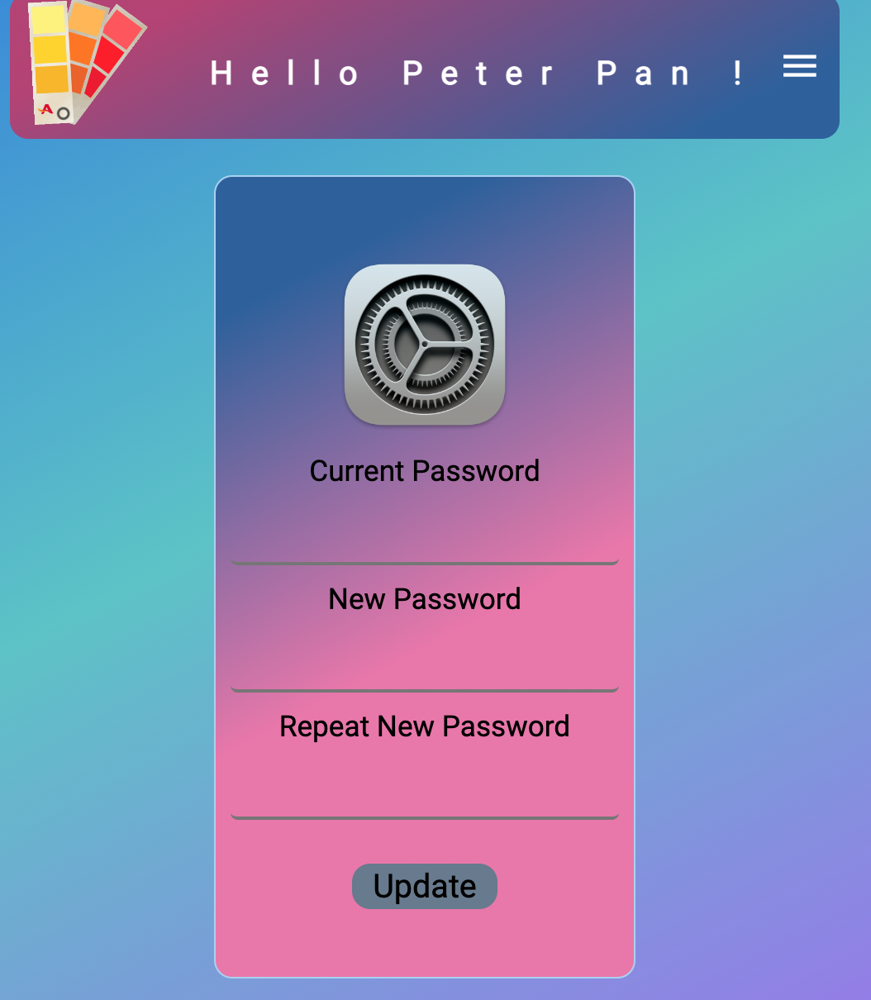

# Postits

Postits is born from a vanilla application to create, save and delete small notes privately, it is an application with api and frontend, where the user can register and start creating their notes, it has a central panel where they are saved so that when entering they can view previously created notes. It has been designed to focus on giving users the opportunity to have an application to save small reminders or notes of interest, you can also make changes to the notes created.
In this version of postits, the first thing that was done was to create an api with MongoDB, based on the user model and notes, managing to control the database.
Additionally, details such as color themes (Light - Dark) were added and a modal window was added to be able to provide feedback when errors occur or a user registers correctly.
The Postits application is a complete application made with Backend and frontend to put into practice everything learned in the fullstack bootcamp for web developers.
The api was made with TDD testing each logic with jasmine.

# Functional Description

## Use Cases
### User
- See profile (postits).
- Add, remove and update notes.
- Change Password.
- Logout.

# Flows

# UI design (wireframes)
## Version Dark

## Version Ligth

## Feedback

